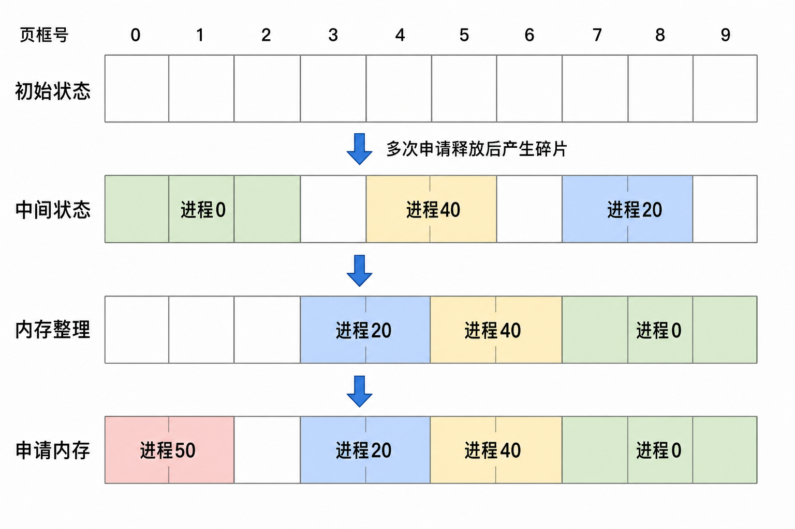

# 页式内存紧凑整理

# 题目内容

实现类 `MemMgmtSys`，管理长度为 `num` 的页数组（下标 $0..num-1$，初始全空闲）：

- `MemMgmtSys(int num)`：初始化。
- `processMemAlloc(int processId, int size)`：为进程申请**连续** `size` 页。从最小下标做首次适应；成功返回起始下标，失败返回 `-1`。保证同一进程在未释放前不会再次申请。
  - 若当前没有足够长的连续空闲段：先**碎片整理**，再按同样规则尝试；仍失败则返回 `-1`。
  - **碎片整理**：收集仍占用内存的进程，按「占用页数升序；相同则 `processId` 升序」排序，再**从高地址一侧起紧密排列**（整体靠右无空隙）；低地址一侧形成一整块空闲。即使整理后总空闲页数仍小于本次 `size`，也必须先完成整理。
- `processMemFree(int processId)`：释放该进程全部页。保证其当前确有占用。
- `processMemQuery(int processId)`：返回该进程当前占用区间的起始下标。保证其当前确有占用。

整理示意（与样例1关键步骤同构）：



## 输入描述

每行一次函数调用；首行必为 `MemMgmtSys(...)`。累计调用 $\le 1000$。

$1\le \textit{size}\le \textit{num}\le 256$，$0\le \textit{processId}\le 10000$。

## 输出描述

每次调用一行结果；无返回值输出 `null`；整型原样输出。

## 样例1

输入：

```
MemMgmtSys(10)
processMemAlloc(0, 3)
processMemAlloc(10, 1)
processMemAlloc(40, 2)
processMemAlloc(30, 1)
processMemAlloc(20, 2)
processMemFree(10)
processMemFree(30)
processMemAlloc(50, 2)
processMemQuery(0)
```

输出：

```
null
0
3
4
6
7
null
null
0
7
```

**说明：**

释放后空闲不连续，分配 `(50,2)` 触发整理：按页数与编号将 20、40、0 紧排在末尾（起始 3、5、7），低地址空出后 50 分到 0；查询 0 得 7。

## 样例2

输入：

```
MemMgmtSys(8)
processMemAlloc(50, 1)
processMemAlloc(30, 1)
processMemFree(50)
processMemAlloc(20, 2)
processMemAlloc(10, 3)
processMemFree(20)
processMemAlloc(40, 5)
processMemQuery(10)
processMemFree(30)
processMemAlloc(40, 5)
```

输出：

```
null
0
1
null
2
4
null
-1
5
null
0
```

**说明：**

申请 5 页时连续不足，仍整理；总空闲仍不足返回 `-1`，但 10 已挪到起始页 5。再释放 30 后申请成功返回 0。
